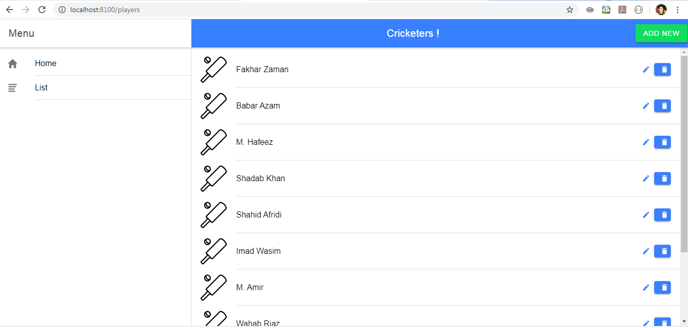

 <h1>I am creating an ionic app with nodejs(backend) and mongodb(expressjs)
 What my app does is it displays a list of cricketers on which you
 can apply CRUD applications.
 .</h1>

<h3>in the first commit i added pages and organized the folder structure .
.</h3>
<h3>in the second commit i added design and logic for login and register pages.
.</h3>
<h3>in the 3rd commit i added readme file with descriptions
.</h3>
<h3>in the 4th commit i added the addplayer component and designed it aswell.
.</h3>
<h3> in 5th commit i completed all the CRUD applications on my project . </h3>
<h3> 6th commit : Read me updated and screenshots shared of the CRUD </h3>

